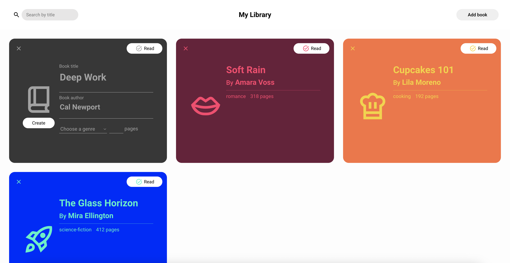
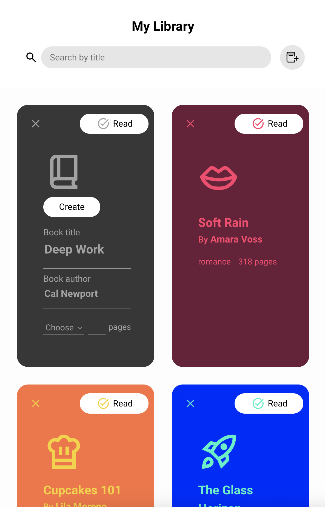

# Dynamic Library Interface (The Odin Project)

## Description
This is my implementation of **The Odin Project’s JavaScript Course Library project**.  
It’s a digital library interface where you can create and visualize all your books through an intuitive interface and track whether each book has been read or not.  
The design is responsive and optimized for both landscape and portrait devices.

## Features
- Dynamic header with a button to add new books and a search bar to filter existing ones by title  
- Responsive main content grid that displays books as interactive cards  
- “Add Book” button opens a form to enter book details, which are saved to a local “database” and rendered dynamically  
- Each book card includes:
  - A **read/unread toggle**
  - A **delete button**
  - A **genre-based color theme** that adapts based on the selected genre and read state

## Tools Used
- **HTML5**
- **CSS3** (Grid, Flexbox, Variables)
- **JavaScript** (Dynamic book creation, interactivity, and search filtering)

## Screenshots
  
  
